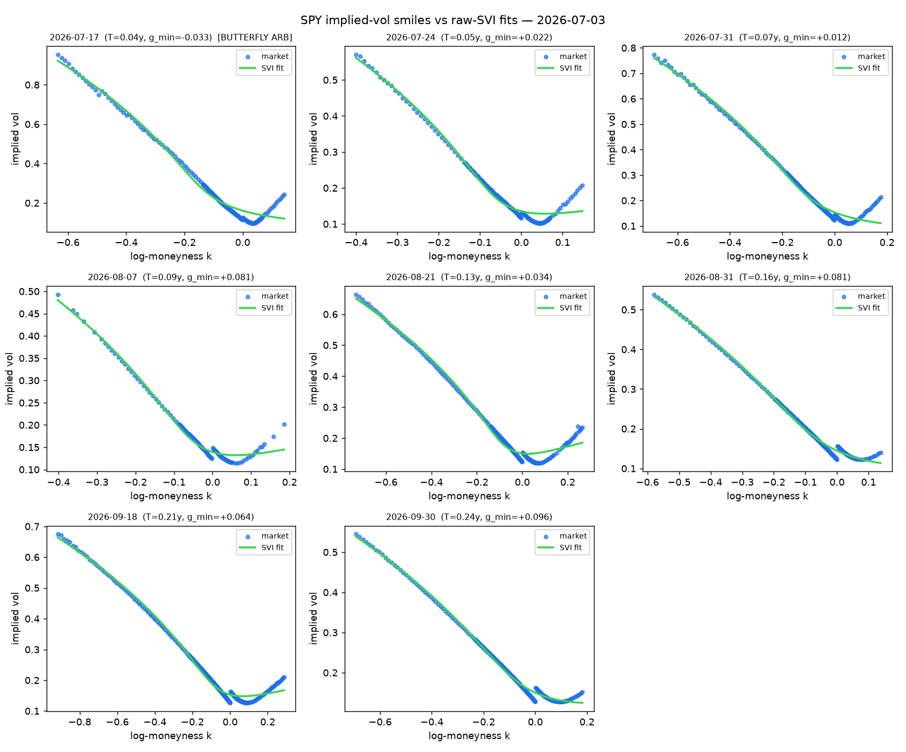
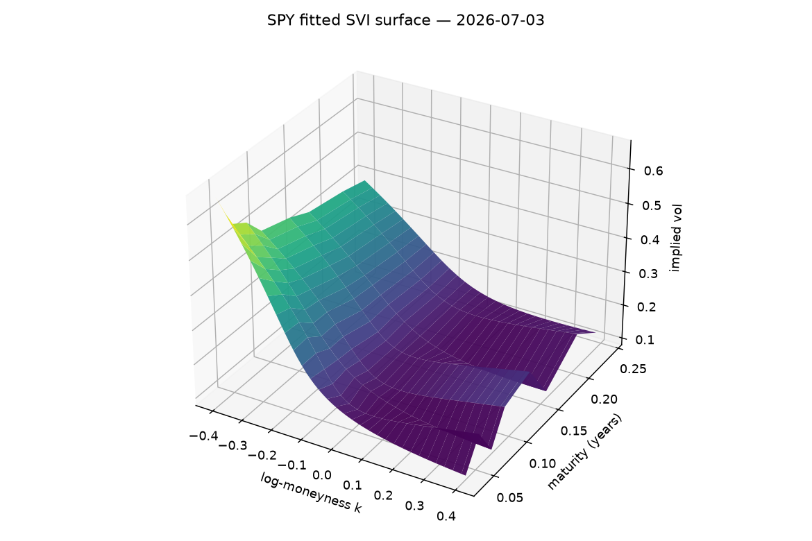

# svi-lab

**A living volatility-surface lab.** Every trading day, a GitHub Action pulls the SPY option chain, fits an arbitrage-checked raw-SVI smile to each expiry, and commits the snapshot below. No API keys, no vendor data — free quotes, real calibration, honest diagnostics.





Latest machine-readable snapshot: [`data/latest.json`](data/latest.json).

## What it does

For each listed expiry (7–400 days out):

1. **Cleans the chain** — live bid/ask only, IV sanity bounds, minimum quote count; builds an OTM slice (puts below the forward, calls above).
2. **Implies the forward** from put–call parity at the strike where |C − P| is smallest (r ≈ 0 over these tenors, documented approximation).
3. **Fits raw SVI** total variance w(k) = a + b(ρ(k−m) + √((k−m)² + σ²)) by bounded least squares from multiple starts (raw SVI is notoriously multi-modal).
4. **Checks static arbitrage** — the Gatheral–Jacquier g-function (butterfly) with *analytic* SVI derivatives, and total-variance monotonicity across expiries (calendar).

A real snapshot (2026-07-03) — note the diagnostics doing their job:

```
SPY surface @ 2026-07-03 - 8 expiries
  2026-07-17  T=0.036y  F=745.53  quotes=214  rmse=0.00050  g_min=-0.0334 [ARB]
  2026-07-24  T=0.055y  F=746.09  quotes=194  rmse=0.00028  g_min=+0.0220 [ok ]
  ...
  2026-09-30  T=0.241y  F=750.07  quotes=275  rmse=0.00060  g_min=+0.0963 [ok ]
  calendar violations on grid: 137
```

The front expiry genuinely fails the butterfly test — short-dated Yahoo quotes are noisy enough that the best-fit slice implies a locally negative risk-neutral density. The lab reports it instead of hiding it; that is the point.

## Install & run

```sh
git clone https://github.com/0scarito/svi-lab && cd svi-lab
pip install -e .
python scripts/refresh.py SPY     # or any ticker with listed options
pytest                            # network-free test suite
```

## The math, briefly

- **Raw SVI** (Gatheral 2004): five parameters per expiry — level `a`, wing slope `b`, skew `ρ`, shift `m`, curvature `σ` — fitted in total-variance space where SVI is nearly linear in its wings.
- **Butterfly arbitrage** (Gatheral & Jacquier 2014, eq. 2.1): the slice is arbitrage-free iff
  `g(k) = (1 − kw′/2w)² − (w′²/4)(1/w + 1/4) + w″/2 ≥ 0`.
  `w′` and `w″` are computed analytically (validated against finite differences in the tests), so `g` is exact up to float error.
- **Calendar arbitrage**: total variance must be non-decreasing in maturity at fixed moneyness; the lab counts grid violations across consecutive fitted slices.

## Limitations (read before trusting any number)

- **Yahoo implied vols** are indicative, especially short-dated and far OTM — this is a lab, not a pricing service.
- **Fits are slice-wise.** Nothing enforces calendar consistency during fitting, so crossings between independently fitted slices are reported, not prevented. Surface-level SSVI/eSSVI calibration (which enforces both no-arb conditions by construction) is the roadmap.
- **`a ≥ 0` constraint**: slightly stronger than Gatheral's minimal condition, guarantees positive variance at a small cost in wing flexibility.
- Forward uses r ≈ 0; fine at these tenors, wrong for multi-year LEAPS.

## Roadmap

- SSVI / eSSVI surface calibration (no-arb by construction) with comparison vs slice-wise fits
- Parameter history: track (a, b, ρ, m, σ) per expiry over time as the cron accumulates snapshots
- More tickers (QQQ, ^STOXX50E where data permits)

## References

- Gatheral (2004), *A parsimonious arbitrage-free implied volatility parametrization with application to the valuation of volatility derivatives*.
- Gatheral & Jacquier (2014), *Arbitrage-free SVI volatility surfaces*, Quantitative Finance 14(1).

MIT © Oscar Caudreliez
