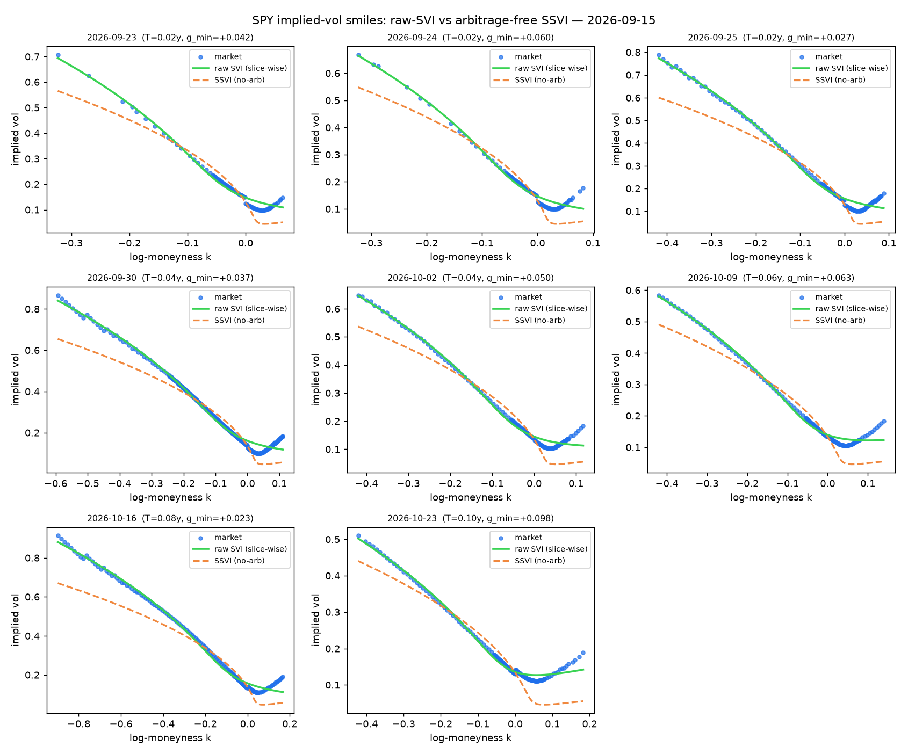
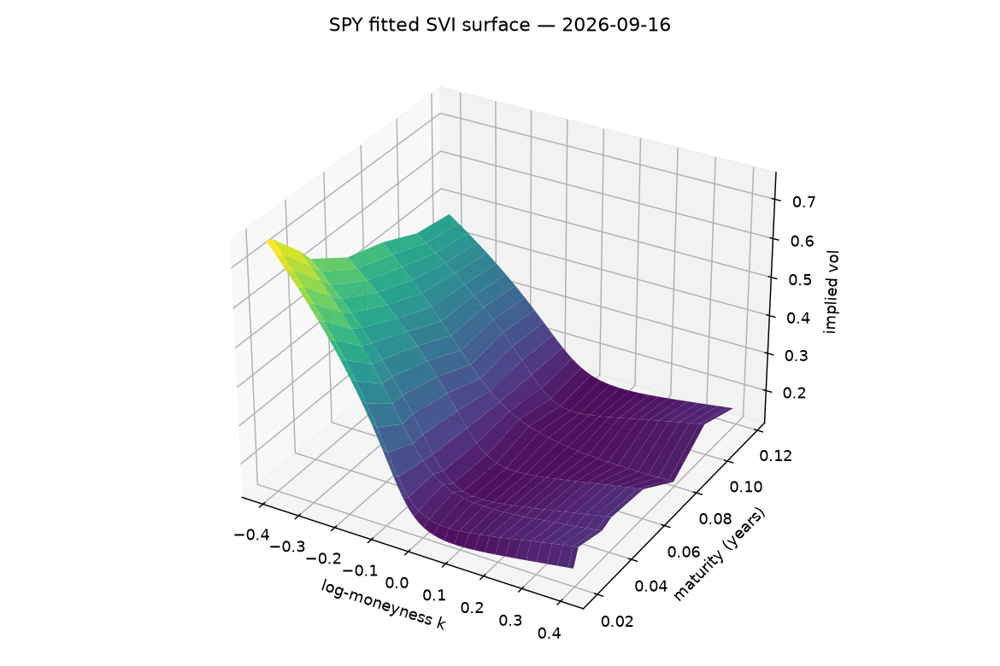
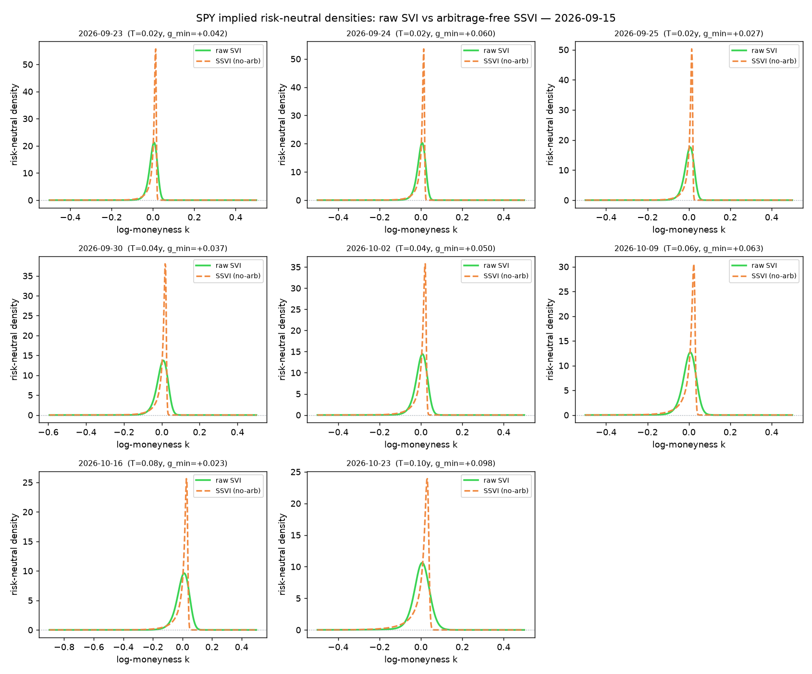
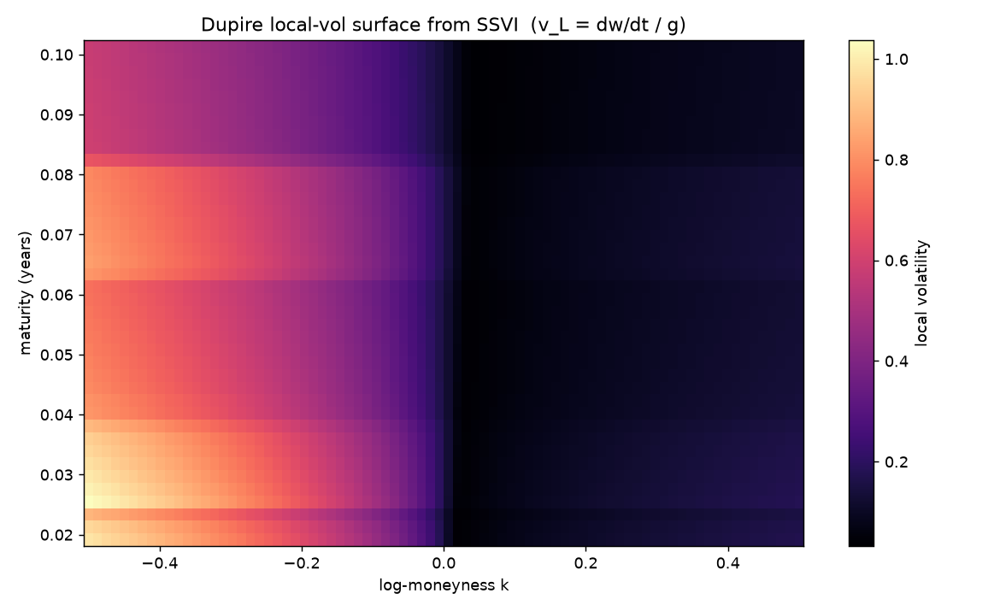

# svi-lab

**A living volatility-surface lab.** Every trading day, a GitHub Action pulls the SPY option chain, fits an arbitrage-checked raw-SVI smile to each expiry, and commits the snapshot below. No API keys, no vendor data — free quotes, real calibration, honest diagnostics.





Latest machine-readable snapshot: [`data/latest.json`](data/latest.json).

## What it does

For each listed expiry (7–400 days out):

1. **Cleans the chain** — live bid/ask only, IV sanity bounds, minimum quote count; builds an OTM slice (puts below the forward, calls above).
2. **Implies the forward** from put–call parity at the strike where |C − P| is smallest (r ≈ 0 over these tenors, documented approximation).
3. **Fits raw SVI** total variance w(k) = a + b(ρ(k−m) + √((k−m)² + σ²)) by bounded least squares from multiple starts (raw SVI is notoriously multi-modal).
4. **Checks static arbitrage** — the Gatheral–Jacquier g-function (butterfly) with *analytic* SVI derivatives, and total-variance monotonicity across expiries (calendar).
5. **Calibrates SSVI on top** — one global (ρ, η, γ) plus the observed ATM total-variance term structure, **arbitrage-free by construction** (see below). The nightly snapshot carries both fits; the smile chart overlays them.
6. **Extracts the risk-neutral density** — the Breeden–Litzenberger density in closed form, straight out of the same g-function (see [Risk-neutral density](#risk-neutral-density)).
7. **Builds the local-vol surface** — Dupire's `v_L = (∂w/∂t) / g(k)`, dividing by that same g-function again (see [Local volatility](#local-volatility)).

A real snapshot (2026-07-03) — note the diagnostics doing their job:

```
SPY surface @ 2026-07-03 - 8 expiries
  2026-07-17  T=0.036y  F=745.53  quotes=214  rmse=0.00050  g_min=-0.0334 [ARB]
  2026-07-24  T=0.055y  F=746.09  quotes=194  rmse=0.00028  g_min=+0.0220 [ok ]
  ...
  2026-09-30  T=0.241y  F=750.07  quotes=275  rmse=0.00060  g_min=+0.0963 [ok ]
  calendar violations on grid: 137
```

The front expiry genuinely fails the butterfly test — short-dated Yahoo quotes are noisy enough that the best-fit slice implies a locally negative risk-neutral density. The lab reports it instead of hiding it; that is the point.

## The cure: SSVI, arbitrage-free by construction

Slice-wise fits can only *diagnose* arbitrage. Since v0.2.0 the lab also calibrates the Gatheral–Jacquier **SSVI** surface (their Section 4): total variance w(k, θₜ) = (θₜ/2)[1 + ρφ(θₜ)k + √((φ(θₜ)k + ρ)² + 1 − ρ²)] with power-law φ(θ) = η / (θᵞ(1+θ)^{1−γ}) — just **3 global parameters** for the whole surface, with θₜ pinned to the observed ATM term structure (isotonic-projected so it never decreases).

Two constraints are enforced *inside* the optimizer, not checked after:

- **η(1+|ρ|) ≤ 2** via reparameterization — the paper's condition for a surface "completely free of static arbitrage";
- **γ ≤ ½** — a subtlety the tests caught: for γ > ½, Corollary 4.1's condition 4 (θφ²(1+|ρ|) ≤ 4) diverges as θ → 0, so the guarantee would only hold on the fitted maturity range. Capped at ½, all four no-arbitrage conditions hold for *every* θ > 0 (short derivation in `ssvi.py`'s docstring).

Verification is shared, not duplicated: every SSVI slice is converted to raw-SVI parameters via the paper's Lemma 3.1 (a = θ(1−ρ²)/2, b = θφ/2, m = −ρ/φ, σ = √(1−ρ²)/φ) and pushed through the **same g-function** used to flag the raw fits. A hostile-data test generates quotes *outside* the arb-free zone and asserts the fit still returns a bound-respecting, statically-arbitrage-free surface — worse RMSE, never arbitrage. The trade is explicit: 3 parameters versus 5 per expiry means SSVI fits each smile a little worse than raw SVI; the comparison table in `data/latest.json` (refreshed nightly) shows both, per expiry.

## Risk-neutral density

Since v0.3.0 the lab reads the **implied risk-neutral density** straight off each fitted smile. Breeden & Litzenberger (1978) say the density is the (undiscounted) second strike-derivative of the call price; Gatheral (2006, *The Volatility Surface*) gives the closed form directly from an SVI slice, so it falls out of the machinery already built — **no numerical differentiation of noisy quotes**:

`p(k) = g(k) / √(2π·w(k)) · exp(−d₋(k)²/2)`,  with  `d₋(k) = −k/√w − √w/2`,

in log-return `k = ln(Sₜ/F)`. The `g(k)` here is *the exact same* `g_function` the butterfly test uses — reused verbatim, not reimplemented. That makes the equivalence concrete: `p` integrates to one over the real line by construction, and it is a **valid (non-negative) density iff `g(k) ≥ 0` everywhere** — i.e. iff the slice is butterfly-arbitrage-free. Arbitrage-free smile, valid density integrating to 1, and `g_min ≥ 0` are three names for one fact; a dip below zero on the chart is the very same thing `[BUTTERFLY ARB]` flags on the smile grid.



```python
import json, numpy as np
from svi_lab import SVIParams, density_stats, risk_neutral_density

params = SVIParams(**json.load(open("data/latest.json"))["slices"][0]["params"])
k = np.linspace(-3, 3, 3001)
mass, mean, var = density_stats(k, params)
print(f"mass={mass:.4f}  mean={mean:+.4f}  var={var:.4f}")   # mass=1.0000  mean=-0.0003  var=0.0006
print(f"peak={risk_neutral_density(k, params).max():.2f}")   # peak=18.57  (front SPY expiry, 2026-07-25)
```

`density_stats` returns `(total_mass, mean, variance)` by trapezoid integration; `slice_density(k, fit[, i])` takes a fitted `SliceFit` or `SSVIFit` directly. On the live 2026-07-25 SPY snapshot every expiry integrated to 1.0000 for both parameterizations — the arbitrage-free SSVI densities (dashed) are visibly more peaked than the raw fits (3 global parameters vs 5 per expiry), the same fit-for-consistency trade, now read off the density.

## Local volatility

Since v0.4.0 the lab also reads the **Dupire local-volatility surface** off the SSVI fit. Gatheral (2006) writes local variance in total-implied-variance terms as

`v_L(k, t) = (∂w/∂t) / g(k)`,

and — for the third time — the denominator `g(k)` is *the exact same butterfly function* (`local_variance` returns it, and a test asserts it equals `g_function` to 1e-12). That makes the whole no-arbitrage story fall into place in one line: **the two checks the lab already runs are precisely the conditions for a valid local-vol surface.** `g(k) > 0` (butterfly) keeps the denominator positive; `∂w/∂t > 0` (calendar) keeps the numerator positive; so local variance is non-negative *exactly* on the arbitrage-free region. Smile fit → risk-neutral density → local vol are three transforms of one surface, all gated by the same `g`.



```python
import numpy as np
from svi_lab import fetch_slices, fit_ssvi, local_vol

ssvi = fit_ssvi(fetch_slices("SPY"))
k = np.linspace(-0.3, 0.3, 25)
print(local_vol(ssvi, k, t=0.25))   # local vol across log-moneyness at 3M
```

`∂w/∂t` is a central finite difference in maturity, held inside the fitted range; `θₜ` is interpolated across the fitted expiries (monotone after the isotonic projection, so `dθ/dt ≥ 0`). A flat smile with total variance linear in `t` returns local vol == implied vol — the sanity check the tests pin.

## Install & run

```sh
git clone https://github.com/0scarito/svi-lab && cd svi-lab
pip install -e .
python scripts/refresh.py SPY     # or any ticker with listed options
pytest                            # network-free test suite
```

## The math, briefly

- **Raw SVI** (Gatheral 2004): five parameters per expiry — level `a`, wing slope `b`, skew `ρ`, shift `m`, curvature `σ` — fitted in total-variance space where SVI is nearly linear in its wings.
- **Butterfly arbitrage** (Gatheral & Jacquier 2014, eq. 2.1): the slice is arbitrage-free iff
  `g(k) = (1 − kw′/2w)² − (w′²/4)(1/w + 1/4) + w″/2 ≥ 0`.
  `w′` and `w″` are computed analytically (validated against finite differences in the tests), so `g` is exact up to float error.
- **Calendar arbitrage**: total variance must be non-decreasing in maturity at fixed moneyness; the lab counts grid violations across consecutive fitted slices.

## Limitations (read before trusting any number)

- **Yahoo implied vols** are indicative, especially short-dated and far OTM — this is a lab, not a pricing service. Yahoo also intermittently serves degenerate chains (observed live: 2 thin expiries instead of 8); the refresh script now refuses to overwrite a good snapshot in that case.
- **Raw fits are slice-wise** — they diagnose butterfly/calendar arbitrage but don't prevent it. That's now by design: they're the honest benchmark the arbitrage-free SSVI fit is compared against.
- **SSVI trades fit for consistency**: 3 global parameters vs 5 per expiry, so per-slice RMSE is worse than raw SVI — the nightly comparison table quantifies exactly how much. θₜ comes from interpolating noisy ATM quotes (isotonic-projected), not from a term-structure model.
- **The density is only as good as the fit.** `risk_neutral_density` is a closed-form transform of the SVI slice, so it inherits every flaw of the fit: front-month smiles are the noisiest, and when a slice fails the butterfly test the "density" genuinely goes negative there (surfaced, not hidden). Its **tails are pure SVI linear-wing extrapolation** — where there are no quotes, the density decays at whatever rate `b(1±ρ)` implies, not at a rate the market told you; treat far-strike density as a model artefact. Total mass drifting from 1 on a wide grid is the built-in warning light.
- **Local vol is built on SSVI and a finite-difference `∂w/∂t`.** The calendar derivative comes from central-differencing the fitted SSVI surface across an interpolated ATM term structure, not from a dense continuum of expiries — so `v_L` is smooth-by-construction between the fitted maturities and says nothing outside them (queries are clamped to the fitted range). It is a diagnostic read of the fitted surface, not an independently-calibrated local-vol model, and it inherits the SSVI-vs-raw fit gap.
- **`a ≥ 0` constraint** (raw fits): slightly stronger than Gatheral's minimal condition, guarantees positive variance at a small cost in wing flexibility.
- Forward uses r ≈ 0; fine at these tenors, wrong for multi-year LEAPS.

## Roadmap

- eSSVI (per-expiry ρ with no-arb interpolation) for better skew term-structure fit
- Parameter history: track fitted parameters over time as the cron accumulates snapshots
- More tickers (QQQ, ^STOXX50E where data permits)

## References

- Gatheral (2004), *A parsimonious arbitrage-free implied volatility parametrization with application to the valuation of volatility derivatives*.
- Gatheral & Jacquier (2014), *Arbitrage-free SVI volatility surfaces*, Quantitative Finance 14(1).
- Gatheral (2006), *The Volatility Surface: A Practitioner's Guide* — the SVI risk-neutral density and Dupire local-variance closed forms.
- Breeden & Litzenberger (1978), *Prices of State-Contingent Claims Implicit in Option Prices*, Journal of Business 51(4).
- Breeden & Litzenberger (1978), *Prices of State-Contingent Claims Implicit in Option Prices*, Journal of Business 51(4).
- Gatheral (2006), *The Volatility Surface: A Practitioner's Guide*, Wiley — SVI closed-form risk-neutral density.

MIT © Oscar Caudreliez
